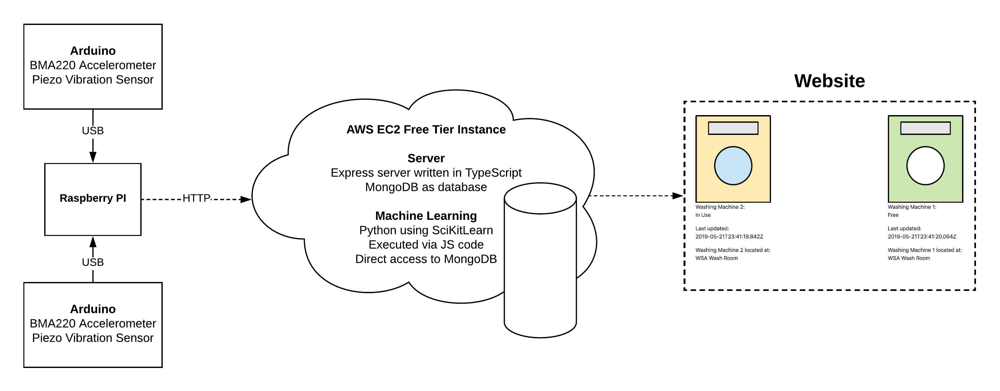

# Continuously Monitoring Washing Machines Using IoT Devices

This repository contains the code developed during the "Internet of Things and Applications" course at Auckland University of Technology in 2019.

The aim of the project is to use IoT devices to continously monitor washing machines. Vibration sensors and accelerometers were used to measure the vibrations of machines. These measurements were then send to a server that would interpret the data using a trained K-Means model and an Elliptic Envelope outlier detection model to determine whether the monitored washing machines are free, in use or exhibiting irregular behavior.

A prototype was created for the project and setup in the following way:

All code used to make the prototype function is present in the repository.

The code is available as-is and further updates should not be expected. Feel free to use any or all of the code as you please.